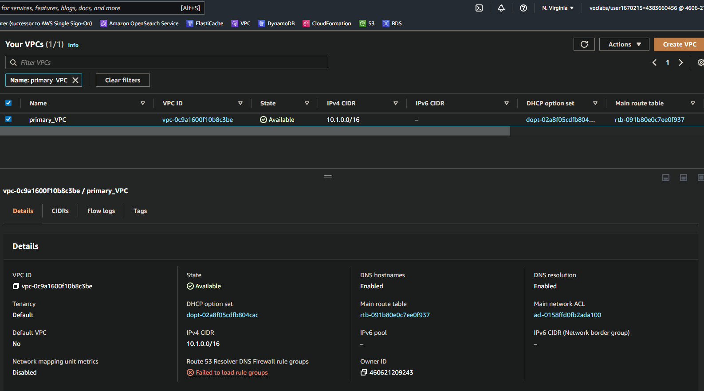
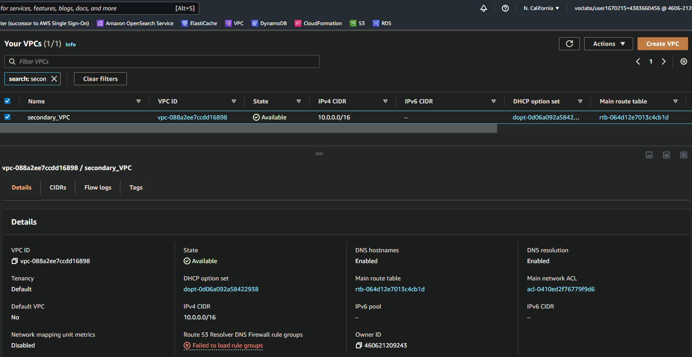

# Data Durability And Recovery

1. Pick two AWS regions. An active region and a standby region (only **us-east-1** and **us-west-2** regions are allowed)

2. Use CloudFormation to create one VPC in each region. Name the VPC in the active region **Primary** and name the VPC in the standby region **Secondary**.

**NOTE**: Be sure to use different CIDR address ranges for the VPCs.

**SAVE**: Screenshots of both VPCs after they are created. Name your screenshots:
____

 

<b> Primary VPC in North Virginia </b>

 

<b> Secondary VPC in North California </b>

_____

## A.1 Highly durable RDS Database
1. Create a new RDS Subnet group in the active and standby region using private subnets.
   
2. Create a new MySQL, multi-AZ database in the active region. The database must:
  * Be a **burstable** instance class.
  * Have only the **UDARR-Database** security group.
  * Have an initial database called **udacity**.

3. Create a read replica database in the standby region. This database has the same requirements as the database in the active region.

**SAVE**: Screenshots of the configuration of the databases in the active and secondary region after they are created. Also, save screenshots of the configuration of the database subnet groups as well as route tables associated with those subnets.

____

 

<b> Primary VPC in North Virginia </b>

 

<b> Secondary VPC in North California </b>

_____
