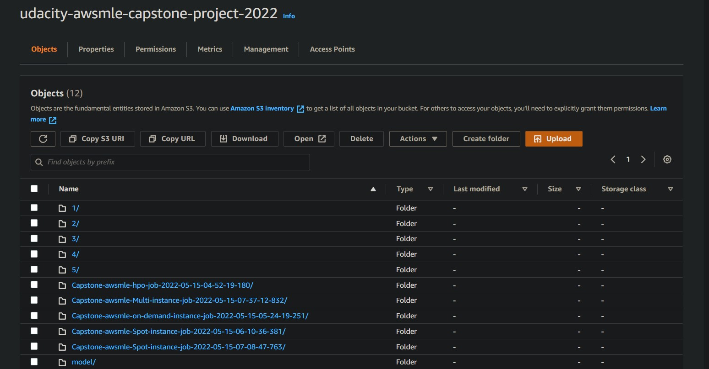

# Inventory Monitoring at Distribution Centers

**Distribution centers** often use robots to move objects as a part of their operations. Objects are carried in bins which can contain multiple objects.

In this project, we will have to build a model that can count the number of objects in each bin. A system like this can be used to track inventory and make sure that delivery consignments have the correct number of items.

To build this project we will use **AWS SageMaker** and good machine learning engineering practices to fetch data from a database, preprocess it, and then train a machine learning model. This project will serve as a demonstration of end-to-end machine learning engineering skills that we have learned as a part of this nanodegree.

## Project Set Up and Installation

Dependencies

````python
Python 3.7
PyTorch >=3.6
````

Installation

For this project, it is highly recommended to use Sagemaker Studio from the course provided **AWS workspace**.

For local development, you will need to setup a jupyter lab instance.

Follow the [jupyter install](https://jupyter.org/install.html) link for best practices to install and start a jupyter lab instance.
If you have a python virtual environment already installed you can just pip install it.

````python
pip install jupyterlab
````

In **AWS Sagemaker**, wahe created a bucket to store all of our downloaded images.

<figure>
  
</figure>

**OPTIONAL:** If your project has any special installation steps, this is where you should put it. To turn this project into a professional portfolio project, you are encouraged to make your `README` detailed and self-explanatory. For instance, here you could explain how to set up your project in AWS and provide helpful screenshots of the process.

## Dataset

### Overview

To complete this project we will be using the Amazon Bin Image Dataset. The dataset contains 500,000 images of bins containing one or more objects. Dataset can be access from [here](https://registry.opendata.aws/amazon-bin-imagery/)

For each image there is a metadata file containing information about the image like the number of objects, it's dimension and the type of object. For this task, we will try to classify the number of objects in each bin.

### Access

#### 1. Resource type

S3 Bucket

#### 2. Amazon Resource Name (ARN)

arn:aws:s3:::aft-vbi-pds

#### 3. AWS Region

us-east-1

#### 4.AWS CLI Access (No AWS account required)

aws s3 ls --no-sign-request s3://aft-vbi-pds/

## Model Training

**TODO**: What kind of model did you choose for this experiment and why? Give an overview of the types of hyperparameters that you specified and why you chose them. Also remember to evaluate the performance of your model.

For this experiment, we have use a [Resnet50](https://viso.ai/deep-learning/resnet-residual-neural-network/) model and decide to tune some parameters:

````python
hyperparameter_ranges = {
    "learning_rate": ContinuousParameter(0.001, 0.1),
    "batch_size": CategoricalParameter([32, 64, 128, 256]),
    "epochs": CategoricalParameter([10,15, 25 , 30 ])    
}
````
<figure>
  
</figure>

