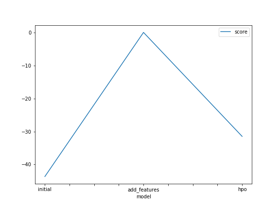
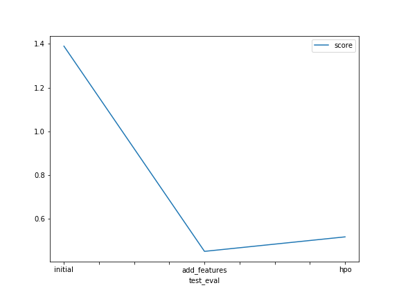

# Report: Predict Bike Sharing Demand with AutoGluon Solution
#### Thierry Kamagne

## Initial Training
### What did you realize when you tried to submit your predictions? What changes were needed to the output of the predictor to submit your results?
When submitting your predictions to kaagle, you need (and have) your predictions > 0 otherwise kaggle will reject your submissions. To workaround , i've set negatives values to zero.

### What was the top ranked model that performed?
It was ``KNeighborsDist_BAG_L1``

## Exploratory data analysis and feature creation
### What did the exploratory analysis find and how did you add additional features?
``EDA`` allows us to better undersatnd data. By plotting a histogram of all features we have seen the distribution of each one relative to the data.

Some variables like:
* holiday, workingday are binary.
* temp, atemp and and humidity are almost normally distributed
* wheras windspeed, causal, registered, count are right-skewed distribution.

As the goal is to ``Forecast use of a city bikeshare system`` and given the ``datetime`` variable, splitting this variable into ``year, month, day, hours and weekday`` would give us much more information.

### How much better did your model preform after adding additional features and why do you think that is?
The first model(without adding new features) perform poorly, given us rmse = 1.39285. By adding new features we have jumped to 0.45194, which is a ``68%`` improvement.

## Hyper parameter tuning
### How much better did your model preform after trying different hyper parameters?
My model did not performs better than the prebious one after trying some parameters like ``num_epochs``, ``learning_rate``, ``activation function``, ``dropout_prob`` (to avoid overfitting) for neural networks models and ``num_boost_round`` and ``num_leaves`` for lightGBM model.

### If you were given more time with this dataset, where do you think you would spend more time?
Maybe spend more time on tuning others hyperparameters.

### Create a table with the models you ran, the hyperparameters modified, and the kaggle score.
|model|hpo1|hpo2|hpo3|score|
|--|--|--|--|--|
|initial|default values|default values|default values|1.38930|
|add_features|default values|default values|default values|0.45194|
|hpo|NN: epochs[10], learning rate: range(10^-4, 10^_2), activation: [relu, softrelu,tanh], dropout_prob: [0.0, 0.5], layers: [[100], [1000], [200, 100], [300, 200, 100]]|GBM: num_boost_round: [100], num_leaves:[26, 66]|default values|0.51812|

### Create a line plot showing the top model score for the three (or more) training runs during the project.

### Create a line plot showing the top kaggle score for the three (or more) prediction submissions during the project.

## Summary
In this project, we use AutoML framework AutoGluon to build ML models thatforecast Bike Sharing Demand. The baseline model give us a poorly result. By doing some feature engineering, we got into the best result. By tunning some hyperparameters or doing hyperparameter optimization, models obtains was not good enough than the previous one.
