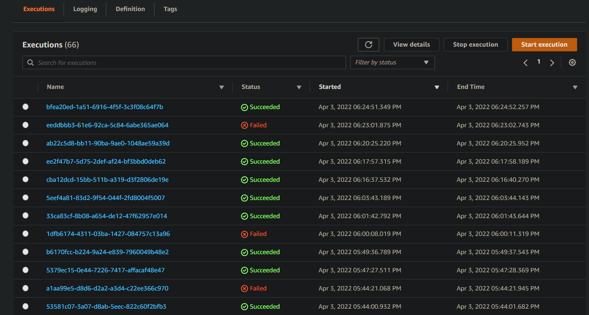

# Build a ML Workflow For Scones Unlimited On Amazon Sagemaker

## Introduction to AWS Machine Learning Final Project

### Overview
In this project, we will build and ship an image classification model with ``Amazon Sagemaker`` for Scones Unlimited, a scone-delivery-focused logistic company.

### Background
Image Classifiers are used in the field of computer vision to identify the content of an image and it is used across a broad variety of industries, from advanced technologies like autonomous vehicles and augmented reality, to eCommerce platforms, and even in diagnostic medicine.

The **image classification** model can help the team in a variety of ways in their operating environment: detecting people and vehicles in video feeds from roadways, better support routing for their engagement on social media, detecting defects in their scones, and many more!

In this project, you'll be building an **image classification** model that can automatically detect which kind of vehicle delivery drivers have, in order to route them to the correct loading bay and orders. Assigning delivery professionals who have a bicycle to nearby orders and giving motorcyclists orders that are farther can help Scones Unlimited optimize their operations.

As an MLE, our goal is to ship a **scalable and safe** model. Once your model becomes available to other teams on-demand, it’s important that your model **can scale to meet demand**, and that **safeguards are in place to monitor and control** for drift or degraded performance.

In this project, we’ll use ``AWS Sagemaker`` to build an **image classification** model that can tell bicycles apart from motorcycles. You'll deploy your model, use AWS Lambda functions to build supporting services, and AWS Step Functions to compose your model and services into an event-driven application. At the end of this project, you will have created a portfolio-ready demo that showcases your ability to build and compose scalable, ML-enabled, AWS applications.

### Project Steps Overview
* Step 1: Data staging
* Step 2: Model training and deployment
* Step 3: Lambdas and step function workflow
* Step 4: Testing and evaluation*
* Step 5: Optional challenge
* Step 6: Cleanup cloud resources

## Getting Started
* Clone this template repository `git clone git@github.com:udacity/nd009t-c1-intro-to-ml-project-starter.git` into AWS Sagemaker Studio (or local development).


* Proceed with the project within the [jupyter notebook](project-template.ipynb).


### Dependencies

```
Python 3.7
Pandas >= 1.2.4
```

### Installation
For this project, it is highly recommended to use Sagemaker Studio from the course provided AWS workspace. This will simplify much of the installation needed to get started.

For local development, you will need to setup a jupyter lab instance.
* Follow the [jupyter install](https://jupyter.org/install.html) link for best practices to install and start a jupyter lab instance.
* If you have a python virtual environment already installed you can just `pip` install it.
```
pip install jupyterlab
```
* There are also docker containers containing jupyter lab from [Jupyter Docker Stacks](https://jupyter-docker-stacks.readthedocs.io/en/latest/index.html).

## Data Staging 
In this step, you will complete the **Data Staging** section of the starter notebook. More specifically, you will first extract the data from the hosting service. Once the data is downloaded, you will explore it and transform it into the correct shape and format. Finally, you will load the data to S3.

## Model training and Deployment
In this step, you will complete the **Model Training** section in the starter notebook.

You will use a ``AWS`` build-in **image classification** algorithm to train the model. Once the model is successfully trained, you will deploy it to an endpoint and configure Model Monitor to track the deployment. At the end, you will make an inference to test the model endpoint.

## Lamdas and Step Function Workflow
In this step, you will work on the **Draft Lambdas and Step Function Workflow** section. You're going to write and deploy three Lambda functions, and then use the Step Functions visual editor to chain them together!

The first lambda function is responsible for data generation. The second one is responsible for image classification. And the third function is responsible for filtering out low-confidence inferences.

Besides the starter notebook, you will also submit other files to demonstrate your work in this step. These files are:

* **Save the code** for each lambda function in a python script called 'lambda.py'
* **Take a screenshot** of the working Step function
* **Export the step function** as a JSON file

## Testing and Evaluation
In this step, you will complete the ùùTesting and Evaluation** section in the starter notebook.

You will first perform several step function invokations using data from the test dataset. This process should give you confidence that the workflow both succeeds AND fails as expected. In addition, you will use the captured data from SageMaker Model Monitor to create a visualization to monitor the model.

## Optional Challenge
This step has many suggestions to make your project stands out but they are optional. Skipping them won't affect your submission.

1. Extend your workflow to incorporate more classes: the CIFAR dataset includes other vehicles that Scones Unlimited can identify with this model.

2. Modify your event driven workflow: can you rewrite your Lambda functions so that the workflow can process multiple image inputs in parallel? Can the Step Function "fan out" to accommodate this new workflow?

3. Consider the test data generator we provided for you. Can we use it to create a "dummy data" generator, to simulate a continuous stream of input data? Or a big parallel load of data?

4. What if we want to get notified every time our step function errors out? Can we use the Step Functions visual editor in conjunction with a service like SNS to accomplish this? Try it out!

5. Write a project README to showcase your project. You can share screencaps of your solution working in Step Functions, your visualization of the ML Model, or any other stretch goals that you pursued and how that went for you

## Cleanup Cloud Resources
**Clean up your resources** to avoid running costs on AWS. Most resources used in this project will be in the **Inference** and **Training** tabs on the SageMaker dashboard, such as **endpoints, models and running instances**.

## Some recommendations

### Execution Flow of the Step Function


### Step Functions Graph and Output


## License
[License](LICENSE.txt)
