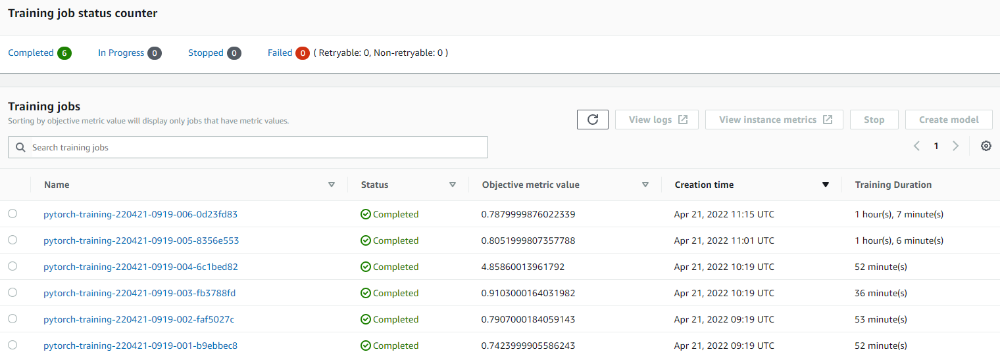
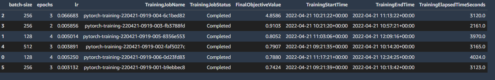
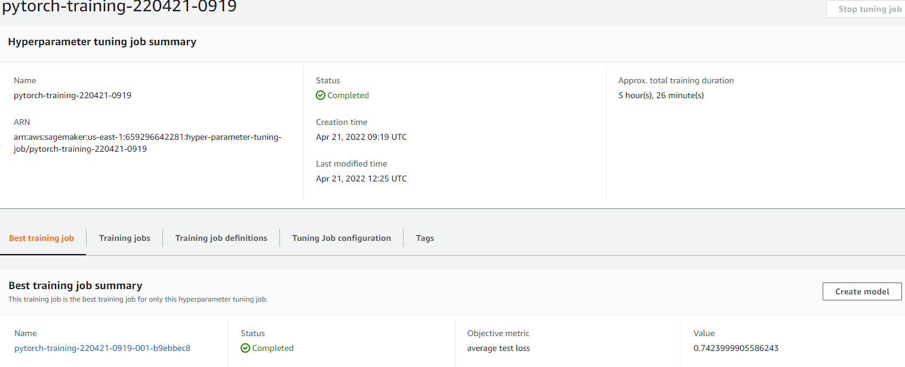
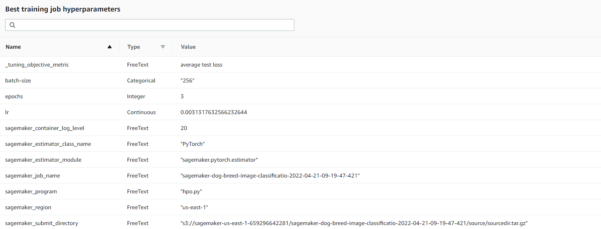
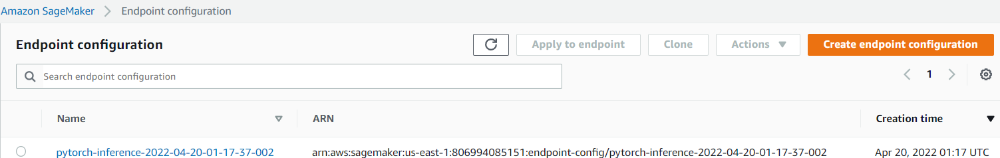
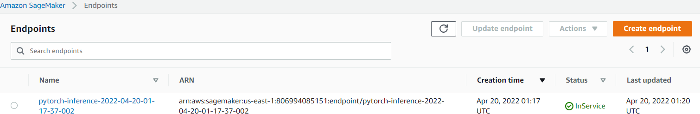

# Image Classification using AWS SageMaker

Use AWS Sagemaker to train a pretrained model that can perform image classification by using the Sagemaker profiling, debugger, hyperparameter tuning and other good ML engineering practices. This can be done on either the provided dog breed classication data set or one of your choice.

## Project Set Up and Installation
Enter AWS through the gateway in the course and open SageMaker Studio. 
Download the starter files.
Download/Make the dataset available. 

## Dataset
The provided dataset is the dogbreed classification dataset which can be found in the classroom.
The project is designed to be dataset independent so if there is a dataset that is more interesting or relevant to your work, you are welcome to use it to complete the project.

### Access
Upload the data to an S3 bucket through the AWS Gateway so that SageMaker has access to the data. 

## Hyperparameter Tuning
For tunning our model, we've made the choice of tuning tunning three hyoerparameters:

* `batch-size` - **batch size**, categorical hyperparameter which define batch size for training/testing/validation dataset. Supported values 128, 256 and 512.
  
* `lr` - **learning rate**, continuous hyperparameters which is used to find better learning rate for the model. Range from 0.001 to 0.1

* `epochs` - **Epochs**, is an integer parameter which is used when an ENTIRE dataset is passed forward and backward through the neural network only ONCE.

Remember that your README should:
- Include a screenshot of completed training jobs
- Logs metrics during the training process
- Tune at least two hyperparameters
- Retrieve the best best hyperparameters from all your training jobs

**Tunning parameters** All 3 types of hyperparameters was tunned in 6 training job by 2 parallel instances. 

<figure>
  
  

</figure>

### Best parameters
* learning rate: 0.003132
* batch-size: 256
* epochs: 3

<figure>
  
  
</figure>

## Debugging and Profiling
**TODO**: Give an overview of how you performed model debugging and profiling in Sagemaker.

For model debugging and profiling, we've retain some rules for debugger jobs:
* `Vanishing_gradient`
* `Overfit`
* `Overtraining`
* `LowGPUUtilization`
* `ProfilerReport`
* `loss_not_decreasing`
* `poor_weight_initialization`

No issue has been found and might be fixed.


### Results
**TODO**: What are the results/insights did you get by profiling/debugging your model?

* Model can be trained less time cause we already use pretrained model. `transfer learning` **allow us to spend less time on training since we need to adjust only output layer and don't need to train entire model from scratch.**

* Bigger `batch-size` might be used to utilize more CPU resources and build more cost optimized predictor

**TODO** Remember to provide the profiler html/pdf file in your submission.


## Model Deployment
The deployed endpoint is accepting bytes for an image, but the butes should be saved from and image. This is implemented in train_and_deploy.ipynb with the Image and io.BytesIO modules. Here is a code sample:

````python
import gzip 
import numpy as np
import random
import os
from PIL import Image
import io

file = 'data/cifar-10-batches-py/data_batch_1'
def unpickle(file):
    import pickle
    with open(file, 'rb') as fo:
        data = pickle.load(fo, encoding='bytes')
    return data

data=unpickle(file)
data=np.reshape(data[b'data'][0], (32, 32, 3), order='F')
im = Image.fromarray(data,mode='RGB')

byteImgIO = io.BytesIO()
im.save(byteImgIO, "PNG")
byteImgIO.seek(0)
byteImg = byteImgIO.read()

response=predictor.predict(byteImg, initial_args={"ContentType": "image/jpeg"})
# Image.open(io.BytesIO(byteImg))
response
````

<figure>
  
  
</figure>

## Standout Suggestions
**TODO (Optional):** This is where you can provide information about any standout suggestions that you have attempted.
